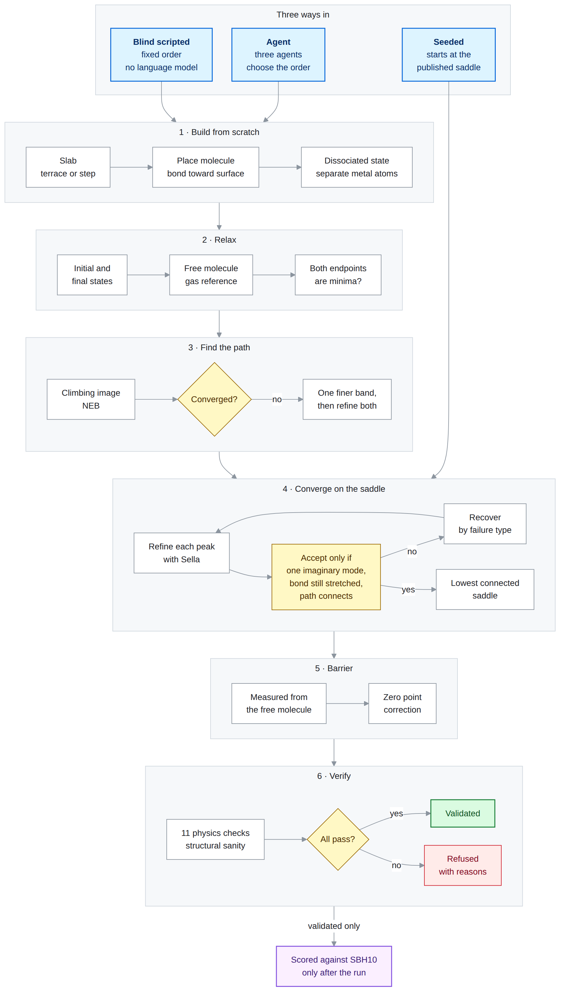

# Agentic surface catalysis: verifying foundation MLIPs on surface reactions

An agent that autonomously builds, relaxes, and computes dissociation barriers on
transition metal surfaces, with a verification layer that refuses any result it
cannot confirm is physically sound. It benchmarks **every public foundational
MLIP** against the same ten experimentally referenced barriers, with dispersion
as an explicit variable rather than a buried default.

Barriers are how the models are measured. Catching structures that are wrong is
what the verification layer is for, and it is the more important of the two.

---

## The question

Universal machine learning interatomic potentials are now good enough that
people use them to screen catalysts. Reaction rates depend on barriers
exponentially: rate ∝ exp(−E<sub>a</sub>/k<sub>B</sub>T). At 500 K a 0.2 eV
barrier error is roughly a 100× rate error. Chemical accuracy is
1 kcal/mol ≈ 0.043 eV.

Most published MLIP evaluation reports energies and forces on equilibrium
structures. Barriers are different: the transition state is, by construction,
a configuration the model was probably never trained on.

**So: how accurate are foundational MLIPs on barriers, referenced to experiment
rather than to more DFT, and does adding dispersion help or hurt?**

That question is not settled. The current best answer from this repository, now
measured across four models and both dispersion settings, is that **dispersion
hurts every model tested, and training domain matters more than architecture.**
See [Current status](#current-status).

## What actually goes wrong

An inaccurate barrier is one failure mode, and the easiest to measure. The more
dangerous one is a model producing a structure that is physically wrong, with an
energy that looks reasonable, and no warning. A wrong barrier on a correct
structure is off by some amount. A wrong structure is not the reaction at all.

This repository has examples of both kinds of wrong structure.

**Produced by a model.** MACE mpa 0, trained on bulk crystals only, places the
CH₄/Ni(111) step transition state 1.755 eV *below* its own reactant state, a
physically impossible sign. UMA, on CH₄/Ni(100), converges cleanly to a first
order saddle with a single imaginary mode at 40.6 meV; pushing the breaking bond
0.35 Å either way relaxes straight back to 2.39 Å, so the saddle belongs to some
other motion entirely and its 0.629 eV "barrier" is not this reaction's.

**Produced by the pipeline.** The endpoint builder placed the two N atoms of
dissociated N₂/Ru(0001) 2.563 Å apart, sharing a surface Ru atom. That is the
repulsive adjacent site arrangement, not the product minimum, which is reached
only once the atoms diffuse onto separate metal atoms (Chorkendorff and
Niemantsverdriet, *Concepts of Modern Catalysis and Kinetics*, section
6.5.3.2). Earlier, CH₄ went down edge first and broke the wrong C–H bond, giving
7 eV against a 0.8 eV reference.

Every one of these produced a plausible number and no exception.

**The limit, stated plainly.** The checks here are generic: mode counts,
connectivity, bond geometry, shared metal atoms, drift. They catch failures that
look the same on every system. They cannot anticipate a failure specific to one
chemistry, which only shows up when that system is actually studied. Nothing in
this repository should be read as a guarantee that an MLIP result is physical;
only that these particular ways of being unphysical have been ruled out.

## Where this sits in the field

The Nature Catalysis roadmap for AI in heterogeneous catalysis (Xin, Kitchin,
López, Schweitzer et al., 2026) sets out five pillars of laboratory autonomy:
task automation, workflow automation, intelligent planning, closed loop
automation, and human machine collaboration. It is worth being precise rather
than flattering about where this project falls.

**This is pillar two, workflow automation, with a verification layer.** The
roadmap's own criticism of that stage is that such systems remain tool centric,
running human designed protocols and static heuristics rather than setting goals
or adapting strategy. That description fits the supervisor and three worker
agents here exactly. The agent executes a fixed sequence with retries. It does
not plan.

What the project does contribute is the guardrail layer the roadmap asks for
separately. In its discussion of foundation models it identifies three
deficiencies to be addressed: poor robustness under domain shift, uncalibrated
uncertainty, and insufficient grounding in physical laws. In its forward looking
architecture it calls for a guardrail stack that blocks high uncertainty or out
of distribution proposals for human verification, operating inside bounded
autonomy windows.

Mapped onto this repository:

| Roadmap requirement | Implementation here |
|---|---|
| Grounding in physical laws | eleven physics checks that never see the reference value |
| Bounded autonomy | `exit_gate`, which the supervisor cannot override |
| Out of distribution detection | four model comparison; saddle confirmation rate splits 4 to 6 of 10 in domain against 0 of 10 out of domain |
| Provenance completeness | `provenance` on every stored result, seeded and autonomous kept in separate directories |
| Negative and null results | `NOTES.md` records diagnosed failures, not just successes |

**What this repository is not.** It is not a data curation contribution, which
the roadmap treats as its first pillar and which requires consortium scale work
on ontologies, ELN integration and cloud platforms. It is not a digital twin or
a planner executor, which the roadmap places at pillar four and which would
require the reactor and microkinetic modelling this project deliberately avoids.

**The next rung is pillar three, intelligent planning**, and the natural form it
takes here is an escalation decision rather than a fixed sequence: run the in
domain models, measure their disagreement, and accept, retry, or escalate to
human or DFT verification. Finding 3 below is the evidence that such a signal
exists in the data. Building and validating it is future work and is marked as
such.

---

## Two tracks, and why they must never be averaged together

A barrier benchmark conflates two different questions. This repository separates
them, and stamps `provenance` on every stored result so they cannot be silently
recombined.

| | **Seeded track** | **Autonomous track** |
|---|---|---|
| Starting geometry | the published BEEF vdW transition state, from the SBH10 SI | built from scratch by the agent |
| Question answered | is the model's energy right at a known saddle? | can the engine find the saddle at all? |
| What it measures | accuracy of the potential energy surface | capability of the search |
| Entry point | `scripts/run_seeded.py` | `invoke.py`, `scripts/run_grid.py` |
| `provenance` | `seeded` | `autonomous` |
| Failure risk | very low: no search to fail | high: this is the hard part |
| Anthropic API | never called | called on every supervisor turn |

**The autonomous track is the product claim.** A customer with a novel catalyst
has no SBH10 entry to start from, by definition. A headline number that quietly
depended on literature geometries would not be evidence that the engine works.

**The seeded track is the diagnostic.** It isolates PES accuracy from search
capability, so that when a reaction fails it is possible to say which of the two
broke. It also guarantees a number on every reaction even when the search does
not converge, which is what makes the failures interpretable rather than blank.
Because it calls tools directly rather than through the agent, it also costs
nothing in API credit, which matters more than it sounds: the autonomous sweep
is the expensive one.

Both are separately comparable to the SBH10 reference. Neither is comparable to
the other without stating the cell and the geometry source. See
[Cell sensitivity](#cell-sensitivity).

---

## Why SBH10

SBH10 (Sharada, Bligaard, Luntz, Kroes, Nørskov; *J. Phys. Chem. C* 2017, 121,
19807) is ten dissociation barriers on transition metal surfaces, referenced to
molecular beam scattering, laser assisted associative desorption, and thermal
experiments.

Three properties make it the right target.

**The references are experimental, not computational.** Agreement means
agreement with reality, not with whichever DFT setup generated a model's
training data. Almost every MLIP benchmark in circulation compares against DFT,
which measures how well a model reproduces its teacher, a different and easier
question.

**Dispersion is the discriminating axis.** In the original study the
dispersion corrected BEEF vdW reached 0.14 eV mean error, beating both a
meta GGA and a screened hybrid, the reverse of the typical gas phase pattern.
Several of the models tested here are trained on RPBE or PBE data with no
dispersion term at all. That is a sharp, testable hypothesis, not a vague gap.

**The SI publishes the transition state geometries.** All ten BEEF vdW saddles
are given as VASP POSCARs, plus Table S1 listing the final adsorption sites.
This is what makes the seeded track possible at all. `data_sbh10_si/poscars.txt`
holds the transcribed POSCARs; `build_seeds.py` parses, tags, and validates them.

The set is small enough to run exhaustively across many models, and hard enough
that models disagree.

### Reference values are not exact, and the table now says so

Several SBH10 references are contested in the source literature.
`src/benchmark.py` carries a `reference_uncertainty_eV` and an
`uncertainty_note` per reaction, because a model cannot beat the experiment's
own spread and a table that pretends otherwise is the first thing a serious
reader attacks.

| Reaction | Reference | Spread in the literature |
|---|---|---|
| `N2_Ru0001_terrace` | 1.84 | 1.3 thermal, 1.8 LAAD, 1.84 chosen, 2.27 QCT |
| `CH4_Ru0001` | 0.80 | 0.38 beam, 0.53 thermal, 0.80 LAAD, 0.85 beam threshold |
| `CH4_Ni111_terrace` | 1.01 | 0.77 thermal against 1.01 beam and lattice coupled |
| `CH4_Ni111_step` | 0.80 | **derived** as 1.01 minus 0.21, not measured directly |
| `H2_Cu100` | 0.74 | 0.74 beam and SRP DFT against 0.60 to 0.62 thermal |

SBH17 (Kroes et al., *J. Chem. Theory Comput.* 2023) revises
`CH4_Ni111_step` to **0.699 eV**, a computed SRP DFT value rather than a
subtraction. This repository still uses SBH10's 0.80 for strict comparability
with the original paper. **Open decision**, logged in `NOTES.md`.

---

## The models

| Key | Backend | Training domain | Surfaces in domain? | Access |
|---|---|---|---|---|
| `uma-s-1p1` | fairchem | OC20 + OMat24 + OMol25 + ODAC23 + OMC25 | **yes** (`oc20` task) | gated |
| `mace-mh-1` | mace | OMat24 pretrain, multi head | **yes** (`oc20_usemppbe` head) | open, ASL academic only |
| `mace-mpa-0` | mace | Materials Project and Alexandria | no, bulk crystals | open |
| `orb-v3-cons-inf-omat` | orb | OMat24 | no, bulk crystals | open |
| `esen-sm-cons-omol` | fairchem | OMol25 (isolated molecules, ωB97M V) | no, molecular | gated |

`training_domain` and `in_domain_for_surfaces` are recorded in `config.MODELS`
and carried into every results table. They are not decoration. OC20 is
adsorbates on slabs; OMat24 is bulk inorganic crystals; OMol25 is isolated
molecules at a molecular level of theory. Running a molecular model on a
periodic slab is out of domain **by construction**. Including those models is
the point, but a table that does not say so reads as a fair fight when it is not.

The interesting result is not a leaderboard. It is *which training domain
transfers to surface barriers, and how much the mismatch costs.* Four of the
five are now measured on the seeded track. The answer is a 3.7x gap in mean
absolute error and a categorical difference in whether a transition state can be
confirmed at all.

**On UMA S 1.2.** The 1.2 checkpoint is incompatible with every installable
`fairchem-core` version tested (2.14.0, 2.13.0, 2.5.0, 1.10.0): the saved
`eSCNMDBackbone` config carries parameters the current library does not accept.
This benchmark therefore uses UMA S 1.1, which works with `fairchem-core`
2.14.0. This is a documented limitation, not a preference.

### Dispersion is per model, not global

D3 damping parameters are fitted to a specific functional, RPBE for OC20 based
models, PBE for OMat24 based ones. `d3_xc` is therefore a per model field.
Using one setting across models would silently invalidate every dispersion
comparison in the benchmark.

Three mechanisms are handled separately:

- **`torch_dftd`**: D3 added as a second additive calculator (UMA, Orb), so it
  contributes forces *during* relaxation rather than as a single point
  correction afterwards. The geometry shift under dispersion is most of the
  effect.
- **`builtin`**: MACE applies dispersion internally via `dispersion=True`.
- **`none`**: ωB97M V already includes dispersion; adding D3 would double count
  it, so `new_calculator` raises rather than silently returning the bare model.

A useful invariant falls out of the additive mechanism: two models that share a
`d3_xc` value must produce an identical D3 contribution on identical geometry,
because the correction depends only on positions and damping parameters, never
on the network's own prediction. Measured on a Cu(111) 3x3x4 slab, `mace-mh-1`,
`mace-mpa-0` and `orb-v3-cons-inf-omat` all give a correction near 0.4295 eV per
atom, agreeing to within 0.6 meV per atom despite MACE applying dispersion
internally and Orb summing a separate `torch_dftd` calculator.

The same invariant holds across the whole benchmark: the three pbe damped models
shift by an identical amount on every one of the ten reactions, to within 1 meV,
while UMA with rpbe damping shifts by a visibly different amount. That is both a
sanity check and a result, since it means the dispersion overcorrection cannot be
blamed on any individual model.

---

## Setup

Two environments are required. **UMA and MACE have conflicting `e3nn` version
requirements and cannot coexist.** `mace-torch` pins `e3nn==0.4.4`;
`fairchem-core` requires `e3nn>=0.5`. Installing MACE into a working UMA
environment breaks UMA outright, with an import failure deep inside the
checkpoint loader rather than at install time. Orb lives with MACE.

```bash
# environment 1: UMA
python3.10 -m venv .venv-uma
source .venv-uma/bin/activate
pip install --upgrade pip
pip install -r requirements.txt

# environment 2: MACE and Orb
python3.10 -m venv .venv-mace
source .venv-mace/bin/activate
pip install --upgrade pip
export CMAKE_POLICY_VERSION_MINIMUM=3.5        # see Troubleshooting
pip install -r requirements-mace.txt
```

```bash
export ANTHROPIC_API_KEY=...
export UMA_CHECKPOINT=/path/to/uma-s-1p1.pt    # or place it in data/
export MLIP_DEVICE=cuda                        # if you have a GPU
export GRID_RESULTS_DIR=/workspace/agentic-surface-catalysis/results/grid
export SEEDED_RESULTS_DIR=/workspace/agentic-surface-catalysis/results/seeded
```

**Set one export per line.** `export A=1 export B=2` on a single line does not
set `B`; it exports a variable literally named `export B`. `MLIP_DEVICE` falling
back to its `cpu` default this way costs an entire overnight sweep and raises no
error. A preflight that asserts on `MLIP_DEVICE == "cuda"` is worth running at
the start of every session.

### GPU architecture matters

`.venv-mace` pins `torch 2.6.0+cu124`, which supports compute capability up to
`sm_90`. **Blackwell cards are `sm_120` and will not run it**, failing with
"no kernel image is available for execution on the device". On Runpod that
rules out RTX 5090, RTX PRO 4500, RTX PRO 6000 and B200. Ada and Ampere cards
work: RTX 4090 and RTX 2000 Ada are both `sm_89`, A100 is `sm_80`, A6000 is
`sm_86`. The Runpod GPU id string is exact, for instance
`"NVIDIA RTX 2000 Ada Generation"`; check with `runpodctl gpu list`.

Note that `torch.cuda.is_available()` can return `True` on an unsupported
architecture while every kernel launch still fails. Force a real computation to
test properly:

```bash
python -c "import torch; x = torch.randn(10, device='cuda'); print(torch.__version__, float(x.sum()))"
```

### Checkpoints

FAIR Chemistry weights are gated: request access at
[huggingface.co/facebook/UMA](https://huggingface.co/facebook/UMA) and
[/facebook/OMol25](https://huggingface.co/facebook/OMol25), agree to the
licence, then place the file in `data/`.

MACE weights are open:

```bash
hf download mace-foundations/mace-mh-1  --local-dir data/mace-mh-1
hf download mace-foundations/mace-mpa-0 --local-dir data/mace-mpa-0
ls data/mace-mh-1 data/mace-mpa-0       # confirm filenames, update config.MODELS
```

Orb resolves its own weights by tag. `config.py` sets `HF_HOME` to
`data/hf_cache/` so every download lands inside the project and later runs are
network free. This matters, because a benchmark whose weights silently
redownload or update between runs is not reproducible.

### Verify before computing anything

```bash
python -c "
from ase.build import fcc111
from src.calculators import new_calculator
slab = fcc111('Cu', size=(3,3,4), vacuum=10.0)
slab.pbc = True
for key in ['mace-mh-1', 'mace-mpa-0', 'orb-v3-cons-inf-omat']:
    for d3 in (False, True):
        slab.calc = new_calculator(key, with_d3=d3)
        print(f'{key:<24} d3={str(d3):<5} E={slab.get_potential_energy():10.4f} eV')
"
```

Every `d3=True` row should be more negative than its `d3=False` counterpart by a
physically sane amount, order 0.4 eV per atom on a dense metal slab. If a row is
off by tens of eV, the damping and functional pairing for that model is wrong,
and every dispersion number downstream would be meaningless.

Then check the structure builder, which needs no GPU and no checkpoint:

```bash
python scripts/check_structures.py      # expect 10 of 10, exit 0
python -m pytest tests/test_day1.py -q  # expect 16 passed
```

---

## Running

A single reaction, verbose. Start here:

```bash
python invoke.py --single H2_Cu111
```

**Seeded track.** Build the seed structures once, then run:

```bash
python build_seeds.py data_sbh10_si/poscars.txt --out work_seeds/
python scripts/run_seeded.py --seeds work_seeds/ --model uma-s-1p1 --d3 off
python scripts/run_seeded.py --seeds work_seeds/ --only H2_Cu111 --d3 on
```

`build_seeds.py` validates as it parses: metal nearest neighbour distances
against bulk, adsorbate above the surface, breaking bond stretched past
equilibrium, and where SBH17 publishes a geometry, the breaking bond length
against it. H2/Cu(111) and N2/Ru(0001) agree with SBH17 to 0.004 and 0.007 Å,
which is what confirms the transcription is sound.

**Autonomous track**, resumable and budget bounded:

```bash
python scripts/run_grid.py --models uma-s-1p1 --dry-run        # list planned runs
python scripts/run_grid.py --models uma-s-1p1 --d3 on          # run them
python scripts/run_grid.py --models uma-s-1p1 --d3 on --limit 2
python scripts/run_grid.py --models uma-s-1p1 --d3 on --only CH4_Ni100
```

`run_grid.py` writes one JSON per completed run and skips anything already
present **unless that result carries a `run_error`**, in which case it is
re attempted. `--limit` counts reactions that actually ran, not plan entries, so
`--limit 2` on a mostly finished sweep attempts exactly two real reactions
rather than being consumed by instant skips. Failures are logged and do not halt
the batch.

**Cell sensitivity**, agent excluded:

```bash
python scripts/cell_test.py --reaction H2_Cu111 --d3 off
```

**Summary and figure**, no GPU required:

```bash
python scripts/save_seeded_summary.py   # writes SEEDED_SUMMARY.md
python analysis/plot_seeded_results.py           # writes analysis/seeded_d3_comparison.png
```

Because the two environments are separate, a full cross model grid is run once
per environment and the results merged afterwards.

### Settings the agent cannot vary

Four quantities are pinned outside the agent's control, because a sweep in
which each run silently chose its own is not a comparable dataset.

- **NEB force tolerance is fixed at 0.05 eV/Å** inside `run_neb` and is not a
  tool argument. It was previously agent settable with a default of 0.10, so
  runs could and did converge to different bars while all reporting success.
- **`FORCE_MODEL`** overrides the model key the agent passes, so the grid can
  pin one model per run. `config.DEFAULT_MODEL` is read once at import, so
  setting `MLIP_MODEL` mid process does nothing.
- **`FORCE_D3`** overrides the dispersion flag the agent passes, for the same
  reason. Unset, both behave exactly as before. The enforced value is resolved
  by `calculators.effective_with_d3`, which is also what every tool records into
  the store, so the calculator and the metadata cannot disagree.
- **`config.REQUIRED_CHECKS`** is the single list of checks a run must pass,
  read by both `validation_summary` and `exit_gate`, so the two cannot disagree
  about what validated means.

---

## Architecture

A supervisor picks which worker acts next; workers report back to it.

- **Structure_Agent**: builds the slab, places the adsorbate, constructs the
  dissociated endpoint
- **Simulation_Agent**: relaxes the endpoints and the gas phase reference, runs
  the climbing image NEB, converts the barrier to a gas phase reference, applies
  the zero point correction
- **Validation_Agent**: runs the physical sanity checks

**One deliberate departure from the standard supervisor pattern: the supervisor
cannot end the run.** `exit_gate` in `src/graph.py` reads the validation record
directly and refuses to exit until every check in `config.REQUIRED_CHECKS` has
actually run and passed. A model that talks itself into "looks good to me" is
exactly the failure this project exists to catch, so the guarantee lives in code,
not in a prompt.

The gate previously tested `all(checks.values())`, which is vacuously
satisfiable: a run that executed three checks and passed them looked identical to
one that executed eleven. It now requires the full set **by name**, so a check
that never ran is a failure rather than an absence.

This is not hypothetical. On 2026-09-14 the agent produced a polished final
report for `CH4_Ni111_step`, headline barrier bolded, caveats listed, reading
entirely like a resolved result. The gate refused it, because
`check_saddle_connects` had returned a 0.02 Å separation between the two
displaced and relaxed endpoints, too small to tell forward from backward. The
refusal was right, but its stated reason was later traced to a measurement bug:
for CH₄ the tool compared the carbon with a hydrogen that stays attached, so
both endpoints read about 1.09 Å. See the bug list.

### Saddle recovery

`refine_saddle` makes one attempt from the NEB peak and reports what it gets.
`refine_saddle_robust` retries, choosing a strategy from how the attempt failed:

| Symptom | Reading | Recovery |
|---|---|---|
| zero imaginary modes | the optimiser left the saddle region and fell into a minimum | smaller initial trust radius, so early steps stay local |
| two or more imaginary modes | a second order saddle: a ridge between two lower symmetry saddles | displace along the **second** imaginary mode, the direction that descends off the ridge |
| one mode, collapsed geometry | a near intact molecule that still shows a soft mode | treated as basin collapse, same recovery |
| one mode, fails connectivity | a real saddle, for a different reaction | pin the breaking bond at its starting length, refine, then polish briefly unconstrained |

Acceptance requires **all three** of exactly one imaginary mode, a breaking bond
still stretched, and connectivity that does not come back false. Each was added
after a case that passed the others:

- CH4/Ni(100) showed one soft mode on a geometry that had relaxed back to a near
  intact molecule. Mode count alone accepted it.
- CH4/Ni(100) later showed one mode on a sane geometry that IRC then rejected as
  belonging to a different process entirely.

Connectivity is checked with **IRC first**, following the imaginary mode itself,
with bond displacement as the fallback. IRC will not converge on a near flat
surface, which is exactly the H2/Pt(111) and H2/Ru(0001) regime, so the fallback
is not optional. A connectivity result of `None` means unknown and is never
treated as a failure: an unidentifiable bond must not reject a result that may
be correct.

One detail taken from sella's source rather than its documentation: IRC caches
its initial diagonalization and restores it when the direction changes, so the
**same** object must be run forward then reverse. Constructing a second object
would repeat the diagonalization and could pick the opposite sign convention,
silently running the same direction twice and reporting it as two sided.

### The checks

Every check is designed to work without knowing what the answer should be.
None of them compares against the reference value.

| Check | Catches |
|---|---|
| `convergence` | energies from non converged optimisations |
| `noise_floor` | results below the model's own resolvable floor |
| `dispersion` | adsorbate drifting away because the model has no vdW term |
| `dispersion_consistent` | a barrier assembled from a mix of D3 on and D3 off steps, which is not a barrier on any single energy surface |
| `gas_reference` | a missing gas phase reference, or a negative well depth meaning the physisorbed state is unbound |
| `fragments` | the wrong bond breaking, or the molecule not dissociating at all |
| `geometry` | atoms driven into the surface; barrier peak at an endpoint |
| `reaction_consistency` | endothermic reaction with a barrier below its reaction energy; chemically impossible magnitudes |
| `endpoints_distinct` | a barrier between two states that turned out to be the same minimum |
| `path_resolved` | a band too coarse to sample the transition state, one image to image step carrying most of the climb |
| `zpe` | a classical barrier reported against a zero point corrected reference |

`endpoints_distinct` is what makes a zero barrier interpretable. Two of the ten
reactions (H₂ on Pt(111) and Ru(0001)) are genuinely non activated, so a
near zero result is correct for those. Checking that the endpoints are
physically different states distinguishes a real non activated reaction from a
failed calculation, without the validator being told which is which.

### Blind evaluation

The agent never sees the reference barrier. No tool reaches `src/benchmark.py`,
and none of the prompts mentions it. Comparison happens in the runner, after the
graph has returned. Any other arrangement measures how well the agent can
curve fit, not how well it can calculate.

Site type is the exception, and deliberately so. Whether a reaction is measured
at a terrace or a step is part of the problem specification, not the answer, so
`run_one` passes it into the task prompt. It previously did not, which meant
`N2_Ru0001_step` and `N2_Ru0001_terrace` sent byte identical instructions while
being scored against references 1.44 eV apart.

A table of Table S1's final adsorption sites, with an fcc against hcp hollow
classifier, was prototyped in `patches/patch_fcc_hcp_sites.py` and
`patches/patch_fcc_hcp_v2.py` and applied on the GPU pod for the CH₄/Ru(0001)
site experiment. **Neither patch is applied to the code in this repository.** A
final state site taken from the reference calculation is much closer to the
answer than a terrace or step label is, so it should not enter the autonomous
pipeline in any case. Where site choice needs testing, the blind approach is to
build both candidates and let the model's own energy decide, which is what
`scripts/probe_site_fix.py` does.

**The agent has seen SBH10.** On 2026-09-22 a validated N₂/Ru(0001) terrace
report said its barrier was "nowhere near the ~0.40 eV step-site value". 0.40 eV
is the SBH10 reference for a different reaction, `N2_Ru0001_step`. No tool
supplied it; the language model recalled it from training. The leak scan now
checks every SBH10 reference and comparison phrasing, not only the current
reaction's value, so quoting is detected. Silent use of a recalled value cannot
be detected by any scan. Evaluation of the agent track is therefore weaker than
"the agent never sees the reference" implies. The blind scripted track below
uses no language model and is unaffected.

**The seeded track is not blind, by construction**, and nothing in it may be
described as if it were. It reads a published transition state. That is the
whole point of stamping `provenance: seeded` on every one of its results and
writing them to a separate directory.

---

## Gas phase referencing

SBH10 barriers are measured relative to a **free molecule**, not to a
physisorbed one. A NEB run between a physisorbed initial state and a
dissociated final state therefore measures against the wrong reference, short
by the physisorption well depth.

The OC20 task is not trained on isolated molecules, so the fix is not to remove
the slab. Instead `build_gas_reference` lifts the molecule about 8 Å clear of
the same slab in the same cell, and the slab contribution cancels in the
difference:

```
well_depth  = E_gasref − E_initial
barrier_gas = barrier_neb − well_depth
```

The sign matters and is easy to get backwards. A positive well depth means the
physisorbed minimum sits *below* the free molecule, so a trajectory starting
from gas is already part way up the hill and the gas referenced barrier must be
smaller than the barrier measured from the physisorbed state.

`compute_gas_referenced_barrier` performs this conversion and reports the well
depth as a diagnostic. For H₂ on Cu the well is shallow and the two conventions
nearly agree; for CH₄ on Ni or Ru, and for N₂ at a Ru step, the correction is
large.

The seeded track uses SBH10's own convention directly: E<sub>b</sub> =
E<sub>TS</sub> − E<sub>asym</sub>, both in the same supercell with the same slab
geometry, the molecule relaxed 8 Å above it. Rebuilding the slab for the
asymptotic state instead of reusing the saddle's own would put a real energy
difference into the reference that has nothing to do with the reaction.

## Zero point correction

**SBH10's tabulated quantity is not a classical barrier.** From the paper,
Section 2.1: transition state energies are the *zero point corrected* difference
between the transition state and the isolated gas phase molecule. Table 2 lists
the correction applied per reaction, and all ten are negative, between 0.03 and
0.14 eV.

A NEB or a refined saddle gives the classical electronic barrier. Scoring that
directly against SBH10 is a convention mismatch of 0.03 to 0.14 eV **in a fixed
direction on every reaction in the set**. That is the same order as the errors
being interpreted, and it biases every computed barrier high, which flatters a
model that undershoots and punishes one that overshoots. Since the dispersion
axis is exactly a question of undershoot against overshoot, omitting this does
not add noise to the conclusion, it inverts it.

`src/zpe.py` computes

```
dZPE          = ZPE(transition state) − ZPE(gas phase molecule)
barrier(zpe)  = barrier(gas referenced, classical) + dZPE
```

Harmonic, over the adsorbate atoms only, slab rigid. Mode bookkeeping is where
this goes wrong silently and is done explicitly: the transition state keeps every
real mode including frustrated translations and rotations and drops exactly one
imaginary mode; the gas molecule drops 5 (linear) or 6 (nonlinear) free modes **by
magnitude**, because at 8 Å a free rotation lands on either side of zero depending
on finite difference noise and filtering by sign keeps some and drops others.

Every one of these raises rather than returning a number: no confirmed first order
saddle, zero or more than one imaginary mode, a residual imaginary mode at the TS,
an imaginary mode in the gas reference outside the free modes, a mismatched
dispersion setting between barrier and Hessian, or |dZPE| greater than 0.5 eV.
There is no clamping and no fallback to zero.

Sanity checks: H₂ gas keeps 1 mode at ZPE about 0.27 eV, CH₄ keeps 9 at about
1.19 eV. Computed dZPE for H₂/Cu(111) is 0.024 eV with dispersion off and 0.075
eV with it on, against the paper's BEEF vdW value of 0.06 eV, all negative. Same
sign, right order of magnitude. Agreement is not exact and is not claimed to be,
because it is a different potential energy surface.

---

## Current status

**Seeded track complete for four models across both dispersion settings, 80
barrier evaluations with no gaps. Blind scripted track: 6 of 10 reactions
validated for UMA with dispersion off, with further fixes committed but not yet
rerun. Autonomous agent track partially complete.** eSEN pending gated access.

### Headline

`barrier_at_reference_geometry_eV` is a single point at the published BEEF vdW
saddle with nothing moved. No search, no refinement, no Hessian. It therefore
exists for every reaction regardless of whether anything downstream converged.

| Model | Surfaces in training? | D3 off | D3 on |
|---|---|---:|---:|
| UMA S 1.1 | yes | **0.166** | 0.445 |
| MACE mh 1 | yes | **0.174** | 0.378 |
| Orb v3 | no | 0.473 | 0.746 |
| MACE mpa 0 | no | 0.769 | 1.030 |

Mean absolute error in eV. BEEF vdW, the best functional in the original paper,
reports 0.14 eV against the same references.

Two independent findings fall out, and they are separable because the design
holds one variable constant while moving the other.

### Finding 1: dispersion makes every model worse

D3 off wins 9 of 10 reactions for UMA, 9 of 10 for MACE mh 1, and 10 of 10 for
both out of domain models. **With dispersion on, 40 out of 40 errors fall below
the reference**, across all four models. That is a systematic one directional
bias, not scatter.

The mean downward shift is 0.433 eV for UMA and 0.273 eV for each of the other
three. That split is not arbitrary: UMA uses rpbe damping, the other three use
pbe.

**The three pbe damped models give shifts identical to within 1 meV on every
single reaction.** MACE applies dispersion through its own internal
`dispersion=True` path; Orb applies it as a summed `torch_dftd` calculator.
Different code, different architectures, different training corpora, same number
to three decimal places on all ten systems.

That is exactly what should happen if the correction depends only on geometry and
damping parameters rather than on the network's own prediction, which is the
premise of adding D3 as a separate term. It also means the overcorrection cannot
be attributed to any individual model. It is a property of applying these damping
parameters to these systems. As a side effect the two implementations validate
each other, which is a stronger check than either could provide alone.

### Finding 2: training domain dominates architecture

| Group | Models | Mean MAE, D3 off | Saddles confirmed |
|---|---|---:|---|
| Surfaces in training | UMA S 1.1, MACE mh 1 | **0.170 eV** | 4 to 6 of 10 |
| Bulk crystals only | Orb v3, MACE mpa 0 | **0.621 eV** | **0 of 10 for both** |

A 3.7x gap in mean absolute error, and a categorical split in whether a first
order saddle can be confirmed at all.

The control that makes this claim safe is **MACE mpa 0**. It shares a backend
with MACE mh 1, so `_build_mace` forces `default_dtype="float64"` for both
regardless of checkpoint. Same numerics, same dispersion mechanism, same code
path. The only difference is that mh 1 saw surfaces in training and mpa 0 saw
only bulk crystals. The out of domain model still confirms zero saddles out of
ten, and is worse in magnitude than Orb despite Orb running at float32.

That rules out numerical precision as the explanation. When Orb first returned
zero confirmed saddles the natural suspicion was that float32 finite differences
were too coarse to resolve Hessian curvature, which would have made it a pipeline
artifact rather than a result. A float64 out of domain model failing identically
settles the question.

The failures are not marginal. MACE mpa 0 places the CH4/Ni(111) step transition
state 1.755 eV **below** its own asymptotic reactant state, against a reference
of 0.800 eV above it: a 2.56 eV error with a physically impossible sign. Orb does
the same on N2/Ru(0001) step. These are not models that degrade gracefully off
domain, they are models with no learned signal for the process at all.

The full per reaction tables are in `analysis/results_seeded_summary.md`, and the figure
is `analysis/seeded_d3_comparison.png`.

### Finding 3: in domain disagreement carries an escalation signal

An escalation trigger needs a confidence estimate available at run time, when
the reference value is unknown by definition. Deep ensembles are the standard
answer and are impractical for foundation models, where a single pretrained
checkpoint is all that exists. Disagreement between two independently trained in
domain models is a cheaper substitute that this benchmark produces for free.

Reactions ordered by how much UMA and MACE mh 1 disagree, dispersion off:

| Reaction | In domain disagreement (eV) | Mean in domain error (eV) |
|---|---:|---:|
| CH4/Ru(0001) | 0.040 | 0.277 |
| H2/Cu(111) | 0.049 | 0.058 |
| CH4/Ni(111) step | 0.100 | 0.123 |
| H2/Pt(111) | 0.105 | 0.074 |
| CH4/Ni(111) terrace | 0.119 | 0.114 |
| H2/Cu(100) | 0.120 | 0.060 |
| H2/Ru(0001) | 0.129 | 0.230 |
| N2/Ru(0001) step | 0.137 | 0.069 |
| CH4/Ni(100) | 0.159 | 0.080 |
| **N2/Ru(0001) terrace** | **0.226** | **0.614** |

Correlation r = +0.54, and the reaction with the largest disagreement is also
the reaction with the largest error. **With n = 10 that gives p = 0.11, so it is
not significant and is not claimed to be.** It is a signal worth building a
trigger around and testing properly on a larger set, not a validated detector.

The firmer result is a negative one. Pooling all four models flips the
correlation to r = −0.18: disagreement from a model never trained on surfaces is
noise rather than information, so **an out of domain model must not be averaged
into a confidence estimate.** Only the specific four model design here, two in
domain and two out, could have separated those two cases.

Reproduce with `python analysis/analyse_disagreement.py`, which prints the sample size
and p value alongside every correlation.

#### Related work, and how this differs

Disagreement as a confidence signal is not new, and the closest recent work
sharpens rather than undermines what is above. Mehdi, Cho and Isayev
(arXiv:2605.00640, May 2026) introduce PROBE, which trains a light classifier on
a frozen MLIP's internal per atom embeddings to predict whether a prediction is
reliable, tested on AIMNet2 and MACE OFF23.

Their ensemble baseline matters here. They evaluate four independently trained
copies of AIMNet2, same data and architecture, different seeds. As a binary
reliability classifier that ensemble reaches 57.6 percent accuracy, below the 60
percent majority class baseline, and as a continuous ranker it manages Spearman
0.229. They attribute this to models trained on the same data making correlated
mistakes in the same underrepresented regions.

That is an independent result pointing the same way as the negative finding
above, by a different mechanism. PROBE shows same architecture disagreement is
weak because the models share blind spots. This benchmark shows that pooling an
out of domain model destroys the signal for the opposite reason, because such a
model is not correlated at all, it is wrong nearly everywhere. Both say that raw
model disagreement is not a free lunch and that which models you disagree
between decides whether the signal means anything.

What is not covered by that work, in its own words, is its stated future
direction: periodic systems, naming materials foundation MLIPs such as MACE MP
and UMA; force uncertainty; and genuine out of distribution evaluation, training
on one chemistry and testing on another. This benchmark sits in the first and
third of those. It is periodic surfaces rather than molecules, it uses UMA, and
its in domain against out of domain split is a deliberate distribution shift
rather than a seed ensemble.

The honest position: the question of how to get a confidence signal out of a
foundation MLIP without a full ensemble is active and well resourced, and
nothing here should be described as first of its kind. The narrower claim that
survives is that the surface reaction regime is named as open by the closest
paper in the area, and this repository has data in it.

### Cross model divergence: CH4/Ru(0001)

Worth stating precisely, because it is exactly what the two track architecture
exists to surface.

UMA could not resolve this reaction in either track. The autonomous run found
the dissociated endpoint drifting 3.9 Å back toward recombination on an
independent relaxation. The seeded run produced a persistent second imaginary
mode between 8 and 11 meV across every refinement attempt and both dispersion
settings. A site placement hypothesis was tested on 2026-09-14, comparing fcc
and hcp starting hollows, and ruled out: both relaxed to an identical geometry
with energies agreeing to about 1 µeV.

MACE mh 1 resolves the same reaction cleanly at the same published geometry: a
confirmed first order saddle, confirmed connectivity, a full zero point
correction, and a barrier of 0.870 eV against the 0.800 eV reference.

The reaction is hard for UMA's potential energy surface specifically. It is not
intrinsically hard.

### Shared weakness: N2/Ru(0001) terrace

The worst reaction for three of the four models, and it stays worst with
dispersion off. It is also the highest barrier in the set and the one with the
widest experimental spread, 1.3 to 2.27 eV against a 1.84 eV reference. Some of
that discrepancy may sit in the reference rather than in the models, and the
honest position is that this one is not yet separable.

### Autonomous track

Nine reaction and dispersion combinations attempted before an Anthropic credit
exhaustion halted the sweep. Six validated:

| Reaction | D3 | computed | validated |
|---|---|---:|---|
| H2_Cu111 | off | 0.737 | yes |
| H2_Cu111 | on | 0.448 | yes |
| H2_Cu100 | off | 0.687 | yes |
| H2_Pt111 | off | 0.237 | yes |
| H2_Ru0001 | off | 0.272 low | yes |
| N2_Ru0001_terrace | off | 1.405 | yes |
| CH4_Ni100 | off | 0.315 | no |
| CH4_Ru0001 | off | 1.088 | no |
| N2_Ru0001_step | off | 0.274 | no |
| CH4_Ni111_terrace | off | 1.116 | no |
| CH4_Ni111_step | off | 0.488 | no |

`CH4_Ni111_terrace` is worth noting even though it did not validate. Its
autonomous value of 1.116 eV sits 4 meV from the seeded track's independent
measurement of 1.111 eV for the same model and dispersion setting, from a
completely different starting geometry. The gate refused it on convergence
grounds, but the physics agrees with itself.

**Five of the six validated rows above are D3 off, and their dispersion check
passed for the wrong reason.** `check_dispersion_consistent` required every
stage to record D3 **on**, and under `FORCE_D3=off` every record stored the
agent's argument, which defaults to on, rather than the setting in force. The
two bugs cancelled. The energies are sound, because every stage genuinely ran
without dispersion, but the check did not establish that. Both are fixed.

After the fixes, two reactions were rerun through the agent on 2026-09-22.
N₂/Ru(0001) terrace validated at 1.411 eV. H₂/Cu(111) did not: the agent made 67
tool calls, rebuilt the whole system from scratch four times after finishing a
calculation, and ran out of supervisor turns. The builder tools now refuse to
rebuild over finished work unless told to explicitly.

### Blind scripted track

`scripts/run_blind.py` runs every reaction through the same tools the agent
uses, in a fixed order, with no language model. Every structure is built from
scratch, no published geometry is read, and the reference is never used. It is
**not** the agent track, is written to its own directory, and is never pooled
with agent results. Its purpose is to separate two questions: whether the tools
can find a validated barrier blind, and whether the agent calls them in a way
that does.

UMA S 1.1, dispersion off, 2026-09-23:

| Reaction | Blind | Reference | Error | Validated | Notes |
|---|---:|---:|---:|---|---|
| H2_Cu111 | 0.745 | 0.63 | +0.115 | yes | |
| H2_Cu100 | 0.687 | 0.74 | −0.053 | yes | |
| H2_Pt111 | 0.232 | 0.00 | +0.232 | yes | |
| N2_Ru0001_terrace | 1.704 | 1.84 | −0.136 | yes | higher of two connected saddles, see below |
| CH4_Ru0001 | 0.962 | 0.80 | +0.162 | yes | first validation on any track |
| CH4_Ni111_terrace | 0.940 | 1.01 | −0.070 | yes | |
| H2_Ru0001 | −0.275 | 0.00 | | no | non activated: band peak at image 1, 18 meV |
| N2_Ru0001_step | 0.982 | 0.40 | | no | only failure: well depth −0.011 eV |
| CH4_Ni100 | 2.613 | 0.76 | | no | CH₃ desorbed at the saddle, correctly refused |
| CH4_Ni111_step | 0.740 | 0.80 | | no | no saddle found near a converged peak |

Barriers in eV. Two unchanged reactions reproduced to within 1 meV across
independent blind runs (H2_Cu100 0.688 and 0.687; H2_Pt111 0.232 twice), and
blind and agent agree to within 1 meV where both validated a first saddle.

**N₂/Ru(0001) terrace has two connected saddles, 1.411 and 1.739 eV.** The
policy used here refined only the last band's peak and took the higher one.
The lower connected saddle sets the rate, and choosing between saddles by
proximity to a reference the pipeline never sees is not allowed. `run_blind.py`
now refines every plausible band peak and keeps the lowest connected saddle. That
is expected to move this result back toward 1.41 eV, further from the reference.
**This has not yet been rerun**, and neither has the well depth tolerance that
should validate N₂/Ru(0001) step. The numbers above are the last completed run.

No CH₄ result validated before 2026-09-23 had passed a working connectivity check:
the check measured a spectator C–H and refused on every CH₄ reaction before
storing a verdict. The two CH₄ rows above are the first to pass one.

A comparison of mean error for runs whose structures were flagged against runs
whose structures were clean is printed by `scripts/compare_tracks.py`. It is not
reported here. The flagged group holds two reactions, one of them flagged only
because a near zero barrier came out slightly negative, so it is one genuine
data point, not a test.

### Cell sensitivity

The seeded track runs in SBH10's cell (2x2x6, quarter monolayer); the autonomous
track runs 3x3x4 (one ninth). `scripts/cell_test.py` runs the identical scripted
pipeline, agent excluded, at both, holding geometry source and slab flexibility
constant with two mobile layers in each:

| Cell | Coverage | Barrier | Classical | dZPE | Error against 0.63 |
|---|---|---:|---:|---:|---:|
| 3x3x4 | 0.111 ML | 0.744 | 0.764 | 0.019 | +0.114 |
| 2x2x6 | 0.250 ML | 0.711 | 0.737 | 0.027 | +0.081 |

**Gap 0.034 eV.** Both confirm genuine first order saddles with full mode
following connectivity. Cell size is *not* what separates the two tracks; the
existing 3x3x4 results stand and the pipeline is not migrating. The larger
seeded against autonomous difference on the same reaction, 0.657 against 0.744
with dispersion off, is attributable to geometry source and relaxation freedom,
not coverage.

Note also that the experimental references are low coverage quantities, so 3x3
at one ninth of a monolayer is *closer* to the physical limit than 2x2 at a
quarter. Matching SBH10's cell would match their methodology, not the physics
their reference encodes. Their 2x2 choice was a stated compromise to keep hybrid
functionals affordable, a constraint this project does not have.

### Saddle recovery: two resolved, two diagnosed

Four seeded reactions originally produced converged saddles that the gate
refused. All four refusals were correct. `refine_saddle_robust` then retried
each with a strategy chosen from the failure mode, and the outcome splits
cleanly in two.

**Resolved, with connectivity confirmed:**

| Reaction | Barrier | Reference | Error | Recovery | Connectivity |
|---|---:|---:|---:|---|---|
| H2/Cu(100) | **0.744** | 0.740 | **+0.004** | ridge, 2 attempts | compressed 0.749 Å, stretched 2.584 Å |
| CH4/Ru(0001) | **1.077** | 0.800 | +0.277 | ridge, 2 attempts | compressed 1.101 Å, stretched 2.700 Å |

H2/Cu(100) at +0.004 eV is the closest single number in the project.
CH4/Ru(0001) is the more interesting case: it had resisted every previous
approach, including a site placement hypothesis tested and ruled out, and its
result predates connectivity being enforced but **holds up under it**. The
saddle is genuine; UMA simply places it 0.277 eV too high.

**Not resolved, and diagnosed rather than merely failed:**

- **`CH4_Ni100`**: four strategies tried, all fail. Default Sella, smaller trust
  radius, ridge displacement, and bond constrained refinement. Every attempt
  that found a single imaginary mode failed connectivity, and drift never fell
  below +0.35 Å even with the bond explicitly pinned. The best available number
  stays the unrefined single point at the published geometry, 0.900 eV against
  0.760, error +0.140, more accurate than anything refinement produced.
- **`CH4_Ni111_step`**: the drift guard rejected it at +0.507 Å against a 0.5 Å
  limit, seven thousandths of an Ångström over a constant with no physical
  derivation. That is too close to accept, so the limit was raised to 0.7 as a
  diagnostic and IRC then rejected it independently: both ends stopped at 2.61
  and 2.75 Å, descending to product in **both** directions. Two criteria agree,
  so the rejection is real and the threshold merely got there first. Limit
  restored afterwards.
- **`H2_Pt111`, `H2_Ru0001`**: both references are about zero, genuinely non
  activated. There is no saddle of consequence to converge onto, and no number
  of retries invents one. An algorithmic limit for this regime, not a defect.

The distinction matters. "UMA has no first order saddle near the published
transition state that connects reactant to product" is a statement about the
model. "Our search did not converge" is a statement about the tooling. Only the
verification layer makes the first one available.

### Silent bugs found and fixed

In every case the pipeline produced a plausible looking number and raised no
exception. Treat these as the representative failure mode of this whole exercise:
**the errors that matter do not raise exceptions.**

- **CH₄ dissociation broke the wrong bond.** `_orient_for_dissociation` returned
  polyatomics unchanged, so ASE's g2 CH₄ went down edge first, and the
  longest bonded pair rule with a strict `>` comparison deterministically
  selected atom 1, the hydrogen pointing **away** from the metal, since all four
  C–H bonds are 1.0897 Å. The band then had to break a C–H bond with the
  hydrogen nowhere near a metal atom: gas phase homolysis, about 4.5 eV, plus
  strain. That is the 7 eV observed on CH₄/Ru(0001) against a 0.8 eV reference.
  The fix ranks candidates by the terminal atom's **height**, and rotates one
  bond to point at the surface.
- **`FORCE_D3` never reached the stored metadata.** `new_calculator` reassigned
  its own local `with_d3`, which Python passes by value, so the calculator was
  built correctly while every tool stored its own original argument. A sweep run
  under `FORCE_D3=off` produced files named `..._d3off.json` whose every record
  claimed `with_d3=True`. `check_dispersion_consistent` could not catch it
  because all stages were wrong in the same direction. Fixed by making
  `effective_with_d3` the single source of truth for both the calculator and the
  record.
- **`run_grid.py` treated crashed runs as completed**, skipping any reaction
  whose result file existed even when that file recorded an API failure and a
  null barrier. Eleven placeholder results sat looking finished until a manual
  audit found them.
- **Gas phase referencing added the physisorption well depth instead of
  subtracting it**, inflating every bound reaction barrier by twice the well
  depth.
- **`site_type` never reached the agent**, so step and terrace reactions sent
  byte identical prompts while scored against references 1.44 eV apart.
- **`NEBTools.get_barrier()` defaults to a spline fit**, which overshot the
  highest computed image by 0.3 eV on under resolved bands. Now `fit=False`.
- **`mace-mh-1` was requested with head `"oc20"`, which does not exist**; MACE
  fell back to `omat_pbe`, a *bulk crystal* head, with only a warning. Every
  MACE surface number would have been wrong in a way that looked entirely
  normal.
- **`check_structures.py` measured the wrong bond.** It compared `ads_i[0]` to
  `ads_i[1]`, the first two adsorbate atoms by index, which for CH₄ is the
  carbon and a hydrogen that *stays in the CH₃ fragment*, reading 1.09 Å in both
  endpoints by definition. Invisible until the orientation fix changed which
  bond breaks.
- **The drift guard measured a spectator bond.** `_breaking_bond_length` used a
  finder with an intact molecule cutoff, so at a 1.909 Å stretched seed it could
  not see the breaking bond at all and returned an untouched 1.09 Å C–H instead.
  Spectator before against spectator after reads +0.012 Å, which looks
  reassuring and means nothing. `run_seeded.py`'s own docstring warns about this
  exact trap. The replacement uses no distance cutoff at all: at a dissociation
  saddle the breaking bond is by construction the farthest anchor to fragment
  distance, so any cutoff can only exclude the right answer. A 2.2x reach was
  tried first and failed the other way, silently returning a spectator once the
  bond passed 2.354 Å.
- **The drift was computed and never used.** Every attempt recorded
  `r_b_drift_A` and the accept decision consulted only the mode count, so a
  collapsed geometry with one soft mode passed. The original `refine_saddle` has
  the same blind spot, which is why the first failures were caught by a human
  reading the drift rather than by code.
- **Connectivity was computed and never used.** The same shape again, one layer
  up: the probe printed a connectivity verdict while `first_order_saddle` was
  still decided without it.
- **The unconstrained polish undid its own constraint.** After pinning the
  breaking bond at 1.909 Å, thirty free steps let it run to 3.049 Å. The drift
  guard would have rejected that, so it failed safe, but the strategy could
  never have succeeded. Reduced to eight steps, which lands at 1.801 Å.
- **Dissociated fragments were placed on a shared metal atom.** The endpoint
  builder guarded fragment separation with a distance margin, 2.0 times the
  intact bond, added after two N atoms recombined during relaxation. That margin
  prevents recombination but says nothing about shared metal atoms, which is the
  condition that actually matters. All six SBH10 reaction families built
  endpoints whose fragments shared a surface atom, N₂/Ru(0001) at 2.563 Å. The
  second fragment's site is now chosen only from sites touching no metal atom the
  first touches, ranked by coordination for C, N and O. Afterwards N₂/Ru(0001)
  builds at 3.96 Å with threefold coordination on both sides.
- **A stale label invented a scientific finding.** The recovery strategy printed
  "retry displaced 0.1 A" as a fixed string. The value actually used was changed
  from 0.1 to 0.3 to 0.6 Å by editing the number, and the label never changed.
  Runs at 0.6 Å reported 0.1 Å, which produced a logged "open question" about why
  0.1 Å worked where larger values had failed. There was no such effect. The
  question has been withdrawn.
- **`_classify_hollow` used the wrong subsurface layer on stepped slabs**,
  comparing a layer against itself and labelling all 34 sites fcc, and returned
  a confident fcc label for four fold hollows where the distinction does not
  exist at all. Found and fixed in the site preference prototype, which is not
  applied to this repository's code.
- **The dispersion consistency check tested that D3 was on, not consistent.**
  `set(values) == {True}` failed every consistent D3 off run. It went unnoticed
  because a second bug made every record claim D3 was on. Five validated D3 off
  agent results passed it that way.
- **Two more checks penalised deliberate D3 off runs.** The same far physisorbed
  contact passed with D3 on and failed with D3 off, and an initial state desorption
  limit did the same. For a barrier referenced to the free molecule, an initial
  state drifted outward is already close to the reference, so neither bears on
  the scored number once the gas referenced barrier exists.
- **The subsurface check flagged every adsorbate atom on stepped slabs.** It
  compared heights against the highest metal atom, and a stepped slab is a
  staircase. Atoms with three metal neighbours at 1.9 to 2.1 Å, textbook hollow
  binding, were called buried. It now asks whether an atom is surrounded by
  metal or sitting on it, which does not depend on cell orientation. All ten
  published transition states pass, and a genuinely buried H is still caught.
- **`check_saddle_connects` measured a spectator bond for CH₄**, the first two
  adsorbate atoms by index, and **classified results against a midpoint that
  moved with the final state.** When fragments were moved onto separate metal
  atoms, the H₂/Cu(111) final state moved to 4.42 Å and the midpoint to 2.59 Å,
  past the correctly dissociated 2.02 Å product, and a correct saddle was
  refused. Both connectivity tests now judge each side against the intact bond
  measured in the initial state.
- **The intact H–H bond was taken as a covalent radius sum**, 0.62 Å against a
  real 0.74 Å, leaving almost no room for a molecular end to count as recombined.
- **The agent rebuilt over finished work until it ran out of turns.** The prompt
  already warned against this. The builder tools now refuse unless told to
  rebuild explicitly.
- **The leak scan looked for one number.** It checked only the current
  reaction's reference, so an agent quoting a different reaction's reference
  from memory passed.
- **The validation agent invented supporting evidence**, calling an error
  "consistent with published benchmarks for this model class". No tool can
  retrieve literature. Its prompt now forbids citing anything no tool returned.
- **A negative well depth of −0.011 eV failed a reaction**, where D3 off wells are
  a few meV and UMA resolves about 0.05 eV. The check now tolerates −0.02 eV.

---

## The pipeline

<p align="center">
  
</p>

The diagram is drawn from `docs/pipeline.mmd`. After editing it, regenerate the image from the repository root with
`npx -p @mermaid-js/mermaid-cli mmdc -i docs/pipeline.mmd -o docs/pipeline.png -b white -w 1000 -s 2`.

Every track uses the same tools. The seeded track skips building and the band,
because it starts from the published saddle; it also reports a single point at
that geometry with nothing moved, which exists for every reaction whether or not
refinement succeeds. The blind scripted track runs the steps in the order shown,
including two parts that are its own policy rather than the tools': a second,
finer band when the first does not converge, and keeping the lowest connected
saddle when more than one band peak refines to one. The agent track reaches the
same tools through a supervisor and three agents, which decide the order
themselves; it may also run a second band, but it refines one peak at a time.
In every track the exit gate, or its scripted equivalent, refuses a result until
every required check has passed.

Nothing before the final box sees the reference barrier. The tools cannot reach
`src/benchmark.py`, and the comparison is made by the runner after the run
returns.

**Where things live**

| Folder | Contents |
|---|---|
| `src/` | the tools, agents, prompts, supervisor graph and exit gate |
| `scripts/` | the runners for each track, pre flight checks, probes and comparisons |
| `tests/` | CPU only regression tests |
| `analysis/` | the headline figure, seeded summary tables and the disagreement analysis |
| `patches/` | every source edit, each explaining the bug it fixed and the evidence |
| `docs/` | the pipeline diagram and its source |
| `data_sbh10_si/` | the transcribed SBH10 transition states and their validation record |

At the root: `config.py` (model registry, thresholds, required checks),
`invoke.py` (single reaction entry point), `build_seeds.py` (SBH10 structures to
ASE), `NOTES.md` (running log), `CLAUDE.md` (working rules) and the licence.

## What is not finished

- **The autonomous sweep is incomplete.** Six validated results out of twenty
  planned reaction and dispersion combinations. The remainder halted on API
  credit exhaustion, not on a technical failure, and the resume path is fixed.
- **The escalation layer is advisory, not autonomous.** `check_run_quality` lets
  the agent see the same physics assessment `benchmark.py` computes after the
  run, early enough to act on it inside its retry budget. It is read only by
  construction: it cannot write to the store, set `validated`, or touch
  `exit_gate`, so an agent that can read the verdict still cannot optimise
  against it. What it does **not** do is decide. A binary accept or escalate
  rule built on the Finding 3 disagreement signal was tested and rejected: under
  leave one out it scored 4 of 10, worse than the 5 of 10 expected by chance, so
  the signal is reported as information for a human rather than enforced as a
  gate. Making that decision autonomous needs more reactions to test against.
- **eSEN has not been swept.** One of the five registered models remains
  untested, blocked on OMol25 gated access rather than on anything technical.
  The other four are complete on the seeded track for both dispersion settings.
- **The out of domain models are only measured on the seeded track.** Orb and
  MACE mpa 0 were never run through the autonomous pipeline, because a model
  that cannot confirm a saddle from a published transition state is not going to
  find one from scratch, and the agent time would have bought nothing. This is a
  deliberate scope decision rather than an omission, but it does mean the
  domain mismatch finding rests on seeded evidence alone.
- **Noise floors are still placeholders.** `noise_floor_eV: 0.3` has been split
  into `model_resolution_eV` and `reproducibility_eV`. The second is `None`,
  **not yet measured**, and is itself one of the intended results. Until it
  exists, no claim that any two barriers differ significantly is supported.
- **The step reactions do not resolve their transition states autonomously.**
  `N2_Ru0001_step` runs end to end and dissociates at the edge but fails
  `path_resolved`: at default image counts a single image to image step carries
  up to 89% of the climb, so the reported barrier is a lower bound on a
  transition state that was never sampled.
- **`CH4_Ru0001` is resolved on the seeded track but not the autonomous one.**
  On the seeded track UMA now gives a confirmed first order saddle at 1.077 eV,
  with connectivity checked. The autonomous failure was a dissociated endpoint
  that was not a genuine minimum: the departed H drifted from 3.96 Å back to
  0.03 Å on re relaxation. That was observed before fragments were kept off
  shared metal atoms, and near complete recombination is what a shared metal
  arrangement would be expected to produce. Whether the site selection fix
  resolves it has not been tested.
- **The blind fixes of 2026-09-23 have not been rerun.** The lowest connected
  saddle rule and the well depth tolerance are committed. The table in the blind
  track section predates both.
- **A step transition state may need a Hessian that includes metal atoms.**
  CH₄/Ni(111) step's band converged, yet three refinements found zero imaginary
  modes. The Hessian covers adsorbate atoms only, and a step transition state
  binds several metal atoms. Untested; a probe is planned.
- **CH₄/Ni(100)'s CH₃ fragment desorbs at the saddle.** One untested hypothesis
  is that without dispersion the initial CH₄ floats away, so the band breaks the
  C–H bond far from any metal atom.
- **Non activated reactions need their own category.** H₂/Ru(0001) has a
  reference of zero and no activated saddle; reporting it as a failed barrier
  misdescribes a correct outcome.
- **The fcc against hcp site prototype is not in the code.** See the blind
  evaluation section.
- **Two reactions have no published transition state anywhere.** CH₄/Ni(100) and
  CH₄/Ru(0001) are experiment only in SBH17's Table 2, blank in every geometry
  column. The seeded track still evaluates them from the SBH10 SI POSCARs, but
  there is no independent geometry to cross check against.
- **The endpoint fix is verified on geometry only.** Fragments now build on
  separate metal atoms for five of six reaction families, checked by inspecting
  the structures written to disk. None has yet been relaxed, run through a NEB,
  or compared against a barrier. It fixes the starting state; whether it
  improves any result is untested.
- **CH₄/Ni(100) cannot hold its dissociated state in a 3x3 cell.** Ni(100) at
  3x3 has nine fourfold hollows, each touching four of nine surface atoms, and no
  pair of them shares zero metal atoms. The builder now raises rather than
  building the repulsive arrangement. At 4x4, 56 of 120 site pairs are disjoint
  and the endpoint builds at 5.01 Å. The autonomous track needs a larger cell for
  this reaction.
- **The endpoint builder still reports the wrong separation.** Its success
  message prints the separation aimed for before fragments are snapped onto real
  hollows, not the one built. N₂/Ru(0001) reported 5.42 Å while the structure
  written to disk had 2.563 Å. Anyone reading only the log would not have seen
  the shared metal problem. Not yet fixed.
- **Only hollow sites are enumerated.** Atomic C, N and O are well served by
  that, since the literature puts them firmly in hollows (C on Fe(100): ontop
  2.92 eV and bridge 1.48 eV above hollow; Bromfield, Curulla Ferré and
  Niemantsverdriet, *ChemPhysChem* 2005). H and CH₃ are not. Methyl prefers top
  sites on Pt, Pd, Au and Ag (Wang et al., *J. Comput. Chem.* 2005), and H on
  Pt(111) is nearly degenerate across all sites. Bridge and top sites are not
  generated at all, so neither can be evaluated.
- **No site or orientation sampling in the autonomous track.** One configuration
  per reaction, so the reported barrier is not a minimum over configuration
  space. `probe_site_fix.py` demonstrates the blind approach on one reaction but
  is not wired into the pipeline.
- **No repeat runs.** Every number is a single run with no estimate of its own
  variability.
- **No out of distribution set.** Magnetic metals, oxides, and metal oxide
  interfaces are where universal MLIPs are known to degrade most, and none are
  covered. This is deliberate for now: MLIPs fail *silently* on magnetic
  systems, producing a smooth but wrong potential energy surface, which is the
  worst case for a benchmark whose entire value is trustworthiness.

## Known limitations of the underlying models

- OC20 and RPBE have no dispersion term. This is why D3 was originally included
  in the relaxation loop by default rather than applied afterward as a single
  point correction: the geometry shift under dispersion is most of the effect.
  **On the evidence in this repository, `with_d3=True` is the wrong default for
  surface barriers on every model tested**, and the registry default should be
  revisited.
- D3 is known to overbind on some metal surfaces. The results here are
  consistent with that and stronger: forty out of forty errors below the
  reference with dispersion on, across four independent models and two separate
  dispersion implementations, with the three pbe damped models shifting by an
  identical amount to within 1 meV on every reaction.
- UMA's benchmarked MAE against its own reference DFT is roughly 0.009 eV. Any
  computed quantity below that is not resolvable from zero, regardless of how
  tightly the optimiser converged. The equivalent floor for the other models is
  not yet measured.
- Absolute D3 energies on dense metal slabs are large, order 0.4 eV per atom,
  and mostly cancel in a barrier, which is an energy *difference* along a path.
  The quantity of interest is how dispersion changes that difference, not the
  magnitude of the correction.

## Troubleshooting

**`dm-tree` fails to build: `CMake must be installed`.** Install cmake
(`brew install cmake`). If it then fails with "Compatibility with CMake < 3.5
has been removed", set `export CMAKE_POLICY_VERSION_MINIMUM=3.5` before
installing.

**`CUDA capability sm_120 is not compatible with the current PyTorch
installation`.** A Blackwell GPU with a pre Blackwell torch build. Either
request an Ada or Ampere card, or install a CUDA 12.8 or newer torch wheel.
Blackwell support requires CUDA 12.8 and above. See
[GPU architecture matters](#gpu-architecture-matters).

**`RuntimeError: lazy wrapper should be called at most once`.** `torch.det`
initialises its LAPACK backend lazily and that initialisation is not
thread safe. LangGraph runs tools in a thread pool, and UMA calls `torch.det`
on the cell matrix during the forward pass, so the second calculator
constructed inside an agent run raises. Every entry point warms `torch.det` on
the main thread before building the graph. Any new entry point must do the same.

**`AttributeError: module 'config' has no attribute 'DEVICE'`.** `DEVICE`
must be defined in `config.py` before `MODELS`.

**`AttributeError: module 'config' has no attribute 'GRID_RESULTS_DIR'`.**
There is no such attribute. `GRID_RESULTS_DIR` and `SEEDED_RESULTS_DIR` are
**environment variables**, read by their respective scripts at module level with
a `/workspace/...` fallback. `config.py` exposes `WORK_DIR` and `OUTPUT_DIR`
only.

**`TypeError: Object of type bool is not JSON serializable`.** A numpy
comparison returned `numpy.bool_`, which does not subclass Python's `bool` and
has no `json` encoder, unlike `numpy.float64`, which subclasses `float` and
serialises fine. Cast comparisons with `bool()` at the source. `run_seeded.py`
also carries a defensive `default=` encoder so a stray numpy scalar cannot throw
away a finished GPU run at the final write.

**`TypeError: unsupported format string passed to NoneType.__format__`.**
`refine_saddle`'s success message formats the NEB record's `barrier_eV` with
`:.3f`. Any caller that constructs a synthetic NEB record must put a real number
there.

**`ModuleNotFoundError: orb_models.forcefield.calculator`.** Newer
`orb-models` moved this to `orb_models.forcefield.inference.calculator`.
`_build_orb` tries both.

**`NotImplementedError: We do not support periodicity along a subset of
axes`.** Orb requires full 3D periodicity. `ase.build.fcc111(..., vacuum=...)`
returns `pbc=[True, True, False]`. `build_slab` sets `slab.pbc = True`; any
ad hoc script must do the same, or models are being compared under different
boundary conditions.

**`WARNING: Head <name> not found in available heads [...], defaulting to
the last head`.** Do not ignore this. MACE silently falls back to a
different head. Check the printed list and set the exact name in
`config.MODELS`.

**`create_react_agent() got unexpected keyword arguments:
{'state_modifier': ...}`.** LangGraph renamed this argument to `prompt`.

**`KeyError: 'messages'`.** Some LangGraph versions yield node keyed chunks
from `.stream()` rather than full state. `run_worker` in `src/graph.py`
passes `stream_mode="values"` and guards on the key being present.

**`Error code: 400, your credit balance is too low`.** The autonomous track
calls Claude on every supervisor turn. `run_one` catches this *inside* itself
and returns a result with `run_error` set rather than raising, so the sweep
continues and writes placeholder files. `run_grid.py` re attempts any result
carrying `run_error`. The seeded track makes no API calls at all and is
unaffected, which makes it the right thing to run when credit is short.

**A backgrounded run appears frozen, logging nothing.** Python block buffers
stdout when it is redirected to a file. Use `python3 -u`. Check `nvidia-smi` for
real utilisation before assuming a hang.

**`zsh: command not found: #`** or a stuck `quote>` prompt. zsh does not treat
`#` as a comment in interactive input, so an inline comment containing an
apostrophe opens an unterminated quote. Put comments on their own line.

**`zsh: bad assignment`** when setting the API key. Shell variable names
cannot contain hyphens. It is `ANTHROPIC_API_KEY` with underscores, and no
spaces around the `=`.

## Reference

Sharada, S. M.; Bligaard, T.; Luntz, A. C.; Kroes, G.-J.; Nørskov, J. K.
*SBH10: A Benchmark Database of Barrier Heights on Transition Metal
Surfaces.* J. Phys. Chem. C 2017, 121 (36), 19807–19815.

Transition state geometries are taken from that paper's Supporting Information.

Closest related work on MLIP confidence signals, and the source of the ensemble
baseline discussed under Finding 3:
Mehdi, S.; Cho, I.; Isayev, O. *Knowing when to trust machine learned
interatomic potentials.* arXiv:2605.00640, May 2026.

Successor set with revised references and published SRP DFT geometries:
Kroes, G.-J. et al. *SBH17: Benchmark Database of Barrier Heights for
Dissociative Chemisorption on Transition Metal Surfaces.*
J. Chem. Theory Comput. 2023, 19 (1), 285–298.
